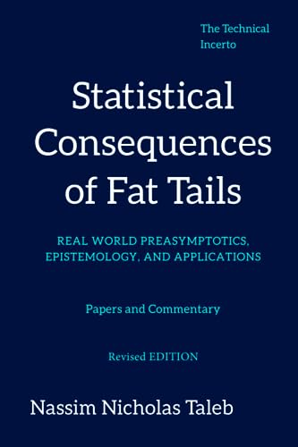

# SCoFT-Taleb
Notes &amp; examples from Taleb's Statistical Consequences of Fat Tails  

Some code and examples are taken from the Global Uncertainty Reading Group (https://www.techincertoreadingclub.com/)  

